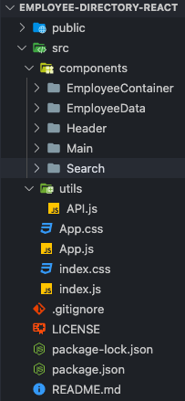

# Employee Directory  [](https://opensource.org/licenses/MIT)

## Table of Contents
1. [Project Overview](#Project-Overview)
2.  [Deployement](#Deployement)
3. [MVP](#MVP)
4. [Installation](#Installation)
5. [Usage](#Usage)
6. [Application Screenshots](#Application-Screenshots)
7. [License](#License)
8. [Credit](#Credit)
****

## Project overview

A employee directory generated using the "Random User API" and pure React > created through React-App. 

### Project Status:

*COMPLETED*

#### Issues to debug:
*NONE TO NOTE*

****

## Deployment

https://p-hsu.github.io/employee-directory-REACT

****

## MVP

### Project-build Aspects:

The following components are used to build the code for this project:

1. pre-set code provided by React-App
2. React JS Library
3. CSS > Bootstrap and Vanilla

### Functionality:

The following lists all functions within this project:

* user can search using last name and table will dynamically populate based on input
* user can filter by LAST NAME by clicking Name column header

### Process:

- use create-react-app to start project
- determine compnents structure
- determine state and perform API call using hook
- properly pass data using state and props
- edit style of page to be coherent and functional

****

## Installation

1. Clone this repository onto local workspace
2. Open Terminal (MacOS) or Git Bash (Windows) and change location to where you want the cloned directory
3. Type `git clone` and paste copied respository
4. Directory should include the following:



## Usage

If starting app from source code > command line:

```
npm start
```


## Application Screenshots


****

## License

This application is licensed under MIT - please refer to the `LICENSE` file in the repo.

## Credit

* [React JS Library Documentation](https://reactjs.org/docs/getting-started.html)
* Animated GIF via [Screencastify](https://www.screencastify.com/)
* Full-stack Bootcamp Program @ [Washington University, Saint Louis](https://bootcamp.tlcenter.wustl.edu/) through [© 2021 Trilogy Education Services, LLC, a 2U, Inc. brand](https://www.trilogyed.com/)